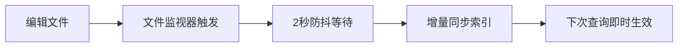

# CodeGraph 中文手册

> **语义代码知识图谱** — 为 AI 编程助手提供代码结构智能
>
> 平均节省 **35% 成本 · 57% 令牌 · 46% 时间 · 71% 工具调用**

---

## 目录

1. [简介](#1-简介)
2. [快速安装](#2-快速安装)
3. [初始化项目](#3-初始化项目)
4. [命令行参考](#4-命令行参考)
5. [MCP 工具列表](#5-mcp-工具列表)
6. [支持的编程语言](#6-支持的编程语言)
7. [支持的 AI 代理](#7-支持的-ai-代理)
8. [VS Code 集成配置](#8-vs-code-集成配置)
9. [工作原理](#9-工作原理)
10. [常见问题](#10-常见问题)

---

## 1. 简介

**CodeGraph** 是一个本地优先的代码智能库 + CLI + MCP 服务器。它使用 tree-sitter 解析任何受支持的代码库，将符号、关系和文件存储在 SQLite（FTS5）数据库中，并通过 MCP 协议向 AI 代理（Claude Code、Cursor、Codex CLI、opencode 等）暴露知识图谱。

- **100% 本地运行**：数据不会离开你的机器，无需 API 密钥，无需外部服务
- **零配置**：开箱即用，无需配置文件
- **自动同步**：文件变更后自动更新索引

### 与传统搜索对比

| 场景 | 传统方式（grep/搜索） | CodeGraph |
|------|----------------------|-----------|
| "这个函数被谁调用了？" | 全局搜索函数名，手动追踪 | `codegraph_callers` 一键获取 |
| "修改这个类会影响什么？" | 人工分析所有引用 | `codegraph_impact` 自动分析 |
| "请求如何到达数据库？" | 逐文件阅读入口→路由→控制器→模型 | `codegraph_trace` 完整调用链 |

---

## 2. 快速安装

### 方式一：一键安装（推荐，无需 Node.js）

**Windows（PowerShell）：**
```powershell
irm https://raw.githubusercontent.com/colbymchenry/codegraph/main/install.ps1 | iex
```

**macOS / Linux：**
```bash
curl -fsSL https://raw.githubusercontent.com/colbymchenry/codegraph/main/install.sh | sh
```

### 方式二：通过 npm 安装

```bash
npx @colbymchenry/codegraph        # 零安装临时使用
npm i -g @colbymchenry/codegraph   # 全局安装
```

安装程序会自动检测并配置已安装的 AI 代理，并询问安装范围（全局/项目本地）。

---

## 3. 初始化项目

```bash
cd your-project
codegraph init -i
```

这将：
1. 在项目根目录创建 `.codegraph/` 文件夹
2. 解析所有源代码，构建知识图谱索引
3. 为项目本地代理配置指令文件

### 索引维护

文件监视器会使用原生操作系统事件（Windows 上为 `ReadDirectoryChangesW`，macOS 上为 `FSEvents`，Linux 上为 `inotify`）自动检测文件变更，并在 2 秒静默期后自动增量同步。



如需手动同步：
```bash
codegraph sync          # 增量更新
codegraph index --force # 完整重建
```

---

## 4. 命令行参考

| 命令 | 说明 |
|------|------|
| `codegraph` | 运行交互式安装程序 |
| `codegraph install` | 显式运行安装程序 |
| `codegraph uninstall` | 从所有已配置的代理中移除 CodeGraph |
| `codegraph init [路径]` | 在项目中初始化（`--index` 同时构建索引） |
| `codegraph uninit [路径]` | 从项目中移除 CodeGraph |
| `codegraph index [路径]` | 完整索引（`--force` 强制重建） |
| `codegraph sync [路径]` | 增量同步 |
| `codegraph status [路径]` | 查看索引统计信息 |
| `codegraph query <搜索词>` | 搜索符号（`--kind`、`--limit`、`--json`） |
| `codegraph files [路径]` | 显示文件结构（`--format`、`--filter`、`--max-depth`） |
| `codegraph context <任务>` | 为 AI 构建上下文（`--format`、`--max-nodes`） |
| `codegraph callers <符号>` | 查找调用者 |
| `codegraph callees <符号>` | 查找被调用者 |
| `codegraph impact <符号>` | 分析变更影响范围（`--depth`） |
| `codegraph affected [文件...]` | 查找受变更影响的测试文件 |
| `codegraph serve --mcp` | 启动 MCP 服务器 |

### codegraph affected — CI/CD 集成

追踪导入依赖关系，找到受源文件变更影响的测试文件：

```bash
# 指定文件
codegraph affected src/utils.ts src/api.ts

# 配合 git diff
git diff --name-only | codegraph affected --stdin

# 自定义测试文件匹配模式
codegraph affected src/auth.ts --filter "e2e/*"
```

---

## 5. MCP 工具列表

当作为 MCP 服务器运行时，CodeGraph 向 AI 代理暴露以下工具：

| 工具 | 用途 |
|------|------|
| `codegraph_search` | 按名称在代码库中搜索符号 |
| `codegraph_context` | 为某个任务构建相关代码上下文 |
| `codegraph_trace` | 追踪两个符号之间的调用路径（"X 如何到达 Y"），每跳内联代码体 |
| `codegraph_callers` | 查找函数的调用者 |
| `codegraph_callees` | 查找函数调用了什么 |
| `codegraph_impact` | 分析修改某个符号会影响哪些代码 |
| `codegraph_node` | 获取某个符号的详细信息（可选包含源代码） |
| `codegraph_explore` | 按文件分组返回多个相关符号的源代码 + 关系图 |
| `codegraph_files` | 获取已索引的文件结构 |
| `codegraph_status` | 检查索引健康状况和统计信息 |

---

## 6. 支持的编程语言

| 语言 | 扩展名 | 状态 |
|------|--------|------|
| TypeScript | `.ts`, `.tsx` | 完全支持 |
| JavaScript | `.js`, `.jsx`, `.mjs` | 完全支持 |
| Python | `.py` | 完全支持 |
| Go | `.go` | 完全支持 |
| Rust | `.rs` | 完全支持 |
| Java | `.java` | 完全支持 |
| C# | `.cs` | 完全支持 |
| PHP | `.php` | 完全支持 |
| Ruby | `.rb` | 完全支持 |
| C | `.c`, `.h` | 完全支持 |
| C++ | `.cpp`, `.hpp`, `.cc` | 完全支持 |
| Objective-C | `.m`, `.mm`, `.h` | 部分支持 |
| Swift | `.swift` | 完全支持 |
| Kotlin | `.kt`, `.kts` | 完全支持 |
| Scala | `.scala`, `.sc` | 完全支持 |
| Dart | `.dart` | 完全支持 |
| Svelte | `.svelte` | 完全支持 |
| Vue | `.vue` | 完全支持 |
| Lua | `.lua` | 完全支持 |
| Luau | `.luau` | 完全支持 |
| Pascal/Delphi | `.pas`, `.dpr`, `.dpk`, `.lpr` | 完全支持 |
| Liquid | `.liquid` | 完全支持 |

---

## 7. 支持的 AI 代理

交互式安装程序可自动检测并配置以下代理：

- **Claude Code** — Anthropic 的命令行 AI 编码助手
- **Cursor** — AI 优先的代码编辑器
- **Codex CLI** — OpenAI 的命令行编码代理
- **opencode** — 开源 AI 编码助手
- **Hermes Agent** — 通用 AI 代理
- **Gemini CLI** — Google 的命令行 AI 助手
- **Antigravity IDE** — AI 驱动的开发环境
- **Kiro** — AI 编码助手

---

## 8. VS Code 集成说明

### 8.1 配置方法

VS Code 1.121+ 版本支持通过 `mcp.json` 文件配置 MCP 服务器。

#### 方式一：通过命令面板创建（推荐）

1. 按 `Ctrl+Shift+P` 打开命令面板
2. 输入 `MCP`，选择 **「MCP: 添加 MCP 服务器」** 或类似命令
3. 按提示填写服务器信息

或者直接运行以下命令（VS Code 会自动创建/打开配置文件）：
```
workbench.mcp.openUserMcpJson
```

#### 方式二：手动编辑配置文件

配置文件位于：`%APPDATA%\Code\User\mcp.json`

```json
{
    "servers": {
        "codegraph": {
            "type": "stdio",
            "command": "node",
            "args": [
                "D:\\codegraph\\dist\\bin\\codegraph.js",
                "serve",
                "--mcp"
            ]
        }
    }
}
```

> **注意**：如果 `codegraph` 已全局安装（在 PATH 中），可以简化为：
> ```json
> {
>     "servers": {
>         "codegraph": {
>             "type": "stdio",
>             "command": "codegraph",
>             "args": ["serve", "--mcp"]
>         }
>     }
> }
> ```

### 8.2 配置后效果

配置完成后**重启 VS Code**，Copilot Chat 就能自动使用以下工具：

| 工具 | 用途 |
|------|------|
| `codegraph_search` | 按名称搜索代码符号 |
| `codegraph_context` | 为任务构建代码上下文 |
| `codegraph_trace` | 追踪两个符号间的调用路径 |
| `codegraph_callers` | 查找函数的调用者 |
| `codegraph_callees` | 查找函数调用了什么 |
| `codegraph_impact` | 分析修改符号的影响范围 |
| `codegraph_node` | 获取符号详细信息 |
| `codegraph_explore` | 返回多个相关符号的源码 |
| `codegraph_files` | 获取已索引的文件结构 |
| `codegraph_status` | 检查索引健康状况 |

### 8.3 验证是否生效

重启 VS Code 后，在 Copilot Chat 中问我：

> "用 codegraph 查一下项目状态"

如果配置成功，我会直接调用 codegraph 工具来回答，而不是手动跑终端命令。

---

## 9. 工作原理

```
┌──────────────────────────────────────────────────────────────┐
│                    AI 编码代理                                │
│  "请求如何到达数据库？" → 直接调用 CodeGraph 工具              │
│                      ↓                                      │
└──────────────────────┬───────────────────────────────────────┘
                       ↓
┌──────────────────────────────────────────────────────────────┐
│                   CodeGraph MCP 服务器                        │
│   context · trace · explore · callers · callees · impact     │
│                      ↓                                      │
│                  SQLite 知识图谱                              │
│          符号 · 关系 · 文件 · FTS5 全文搜索                   │
└──────────────────────────────────────────────────────────────┘
```

1. **提取** — tree-sitter 将源代码解析为 AST，特定于语言的查询提取节点（函数、类、方法）和边（调用、导入、继承、实现）
2. **存储** — 所有数据存入本地 SQLite 数据库（`.codegraph/codegraph.db`），支持 FTS5 全文搜索
3. **解析** — 提取后进行引用解析：函数调用→定义、导入→源文件、类继承及框架特定模式
4. **自动同步** — MCP 服务器使用原生文件系统事件监视项目变更

### 框架感知路由

CodeGraph 能识别 Web 框架的路由文件，将 URL 模式与处理函数关联起来：

| 框架 | 识别模式 |
|------|----------|
| Django | `path()`、`re_path()`、`url()` 等 |
| Flask | `@app.route()` 装饰器、蓝图路由 |
| FastAPI | `@app.get()`、`@router.post()` 等 |
| Express | `app.get()`、`router.post()` 等 |
| NestJS | `@Controller` + 方法装饰器 |
| Laravel | `Route::get()`、`Route::resource()` |
| Rails | `get '/x', to: 'users#index'` |
| Spring | `@GetMapping`、`@PostMapping` 等 |
| ASP.NET | `[HttpGet("/x")]` 属性 |
| Gin / chi | `r.GET()`、`router.HandleFunc()` |

### 跨语言桥接

针对混合 iOS / React Native / Expo 代码库，CodeGraph 能跨越语言边界追踪调用关系：

- **Swift ↔ Objective-C**：`@objc` 自动桥接
- **React Native 传统桥接**：JS `NativeModules` → 原生方法
- **React Native TurboModules**：JS 接口 → 原生实现
- **Expo Modules**：JS `requireNativeModule` → Swift/Kotlin 模块
- **事件通道**：跨语言 `sendEventWithName` → `addListener`

---

## 10. 常见问题

### 如何查看当前索引状态？

```bash
codegraph status
```

如果有待同步的文件，会显示 `### Pending sync:` 部分。

### 索引速度慢怎么办？

检查 `node_modules` 等大型目录是否被排除。默认情况下，`node_modules`、`vendor`、`dist`、`build`、`target` 等目录会自动排除。

### MCP 连接不上？

1. 确保项目已初始化：`codegraph init`
2. 验证 MCP 配置中的路径是否正确
3. 从命令行测试：`codegraph serve --mcp`

### 找不到某些符号？

MCP 服务器会在文件保存后自动同步（等待约 2 秒）。也可以手动运行 `codegraph sync`。检查文件语言是否受支持，以及文件是否位于 `.gitignore` 或默认排除目录中。

### 如何卸载？

```bash
codegraph uninstall
```

将反转安装过程，移除 MCP 服务器配置、指令文件和权限设置。项目索引（`.codegraph/`）不会被删除，可使用 `codegraph uninit` 单独移除。

---

> **更多信息**：[官方文档](https://colbymchenry.github.io/codegraph/) · [GitHub](https://github.com/colbymchenry/codegraph) · [报告问题](https://github.com/colbymchenry/codegraph/issues)
